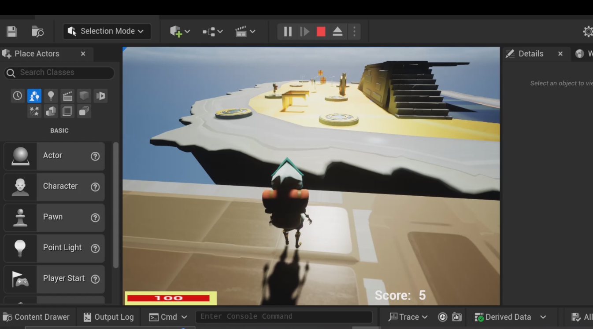

This is an Unreal Engine5 coombat game where you combat with many enemies with different kinds of tools.
I only put all the blueprints and the level map here because the source assets are way too big to upload to Github.

Features:
Used behavior tree to design the patrol route of enemies. They will chase after the player when the play gets close to them.
However, when the player gets away, enemies will stop chasing after the player and return to their patrol route.

Flowers in the mpa work as health pack. Whenever the player hits flowers, flowers will be destroyed and the health value of the player will increase.

